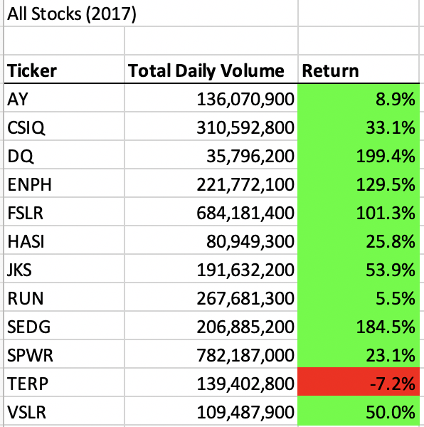
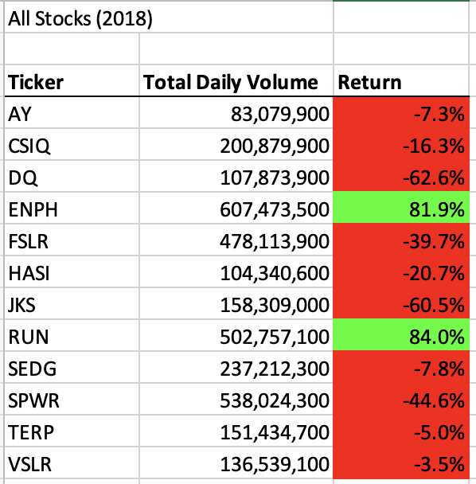

# Stock-Analysis Module-2 Challenge
Performing analysis to complete the module 2 challenge 

## *Project Overview*

#### The purpose of this data analysis is to help a friend named Steve whose first client is his parents. Steve’s parents are passionate about green energy and has decided to invest on DAQ0 (DQ) New Energy Corporation. Steve is concerned about diversifying their funds and want to analyze a handful of green energy stocks (12 total) including the DQ stock since DQ might not be the best option for his parents. In order to help him, we created macros in Visual Basic for Applications (VBA) that would be efficient to make calculations and use complex logic to perform analysis with less accidents and errors, user-friendly, and flexible at the same time for future use. Two macros were created, the original VBA script (Module 2 solution) and a refactored version of the same script to make the code more efficient. Both of these scripts will be compared in terms of efficiency which will be discussed later in this report. 

#### Steve has compiled data in excel for the stocks that he wanted to analyze from 2017 and 2018. The macros were designed to analyze the total daily volume of each stock to measure how actively a stock is traded and the yearly return for each stock, the percentage difference in price from the beginning of the year to the end of the year. These macros should help him with his assessment as to which stocks his parents should really invest in. 

## *Results Analysis*

### Stock Analysis based on 2017 vs 2018 Performance

-   Based on the data analysis, all stocks in the year 2017 performed very well except for the company that has a ticker symbol of “TERP” were the return is -7.2% (refer to chart 1). The DQ symbol which Steve’s parents are interested in, has been fairly traded with the highest return value of 199.4% amongst the rest of the stocks. This is a sign of a good stock for short-term investment because it offers the most profit potential. However, because DQ is only fairly traded, meaning the stock is not in demand (low volume compared to others) it is not good for long term investment because it is not sustainable. This is highlighted in the year 2018 performance were the DQ trading activity is lower compared to most of the stocks except “AY” and with the lowest return percentage of -62.6%.  Most of the stocks in year 2018 have lower returns as well but not as unstable as DQ except for stock symbols ENPH and RUN with positive returns 81.9% and 84.0%, respectively (refer to chart 2). One can assume that the amount of volume should help predict the success in returns. However, that is not the case for the data set presented below (charts 1 and 2). The data shows that there is no correlation between the total daily volume and return. Therefore, I would recommend to Steve that his parents should invest on stocks that are less volatile (e.g. ENPH and RUN).   

Chart 1:

Chart 2:

### Execution Times Analysis between Original vs Refactored Scripts 

-   The results show that the refactored script ran faster than the original script. The original script completed the analysis for 0.5 seconds for both 2017 and 2018 data sets. Whereas, the refactored script completed the analysis for the 2017 and 2018 data sets for 0.08203125 and 0.08203125 seconds, respectively. 

## *Summary*

1. *Advantages and disadvantages of refactoring code in general.*

- Refactoring is a key part of the coding process. It is a process to make the execution of the script efficient (e.g. fewer steps, using less memory, or improving the logic of the code for future read) without adding new functions. On the other hand, refactoring could lead to introducing of non-working codes (e.g. bugs).  

2. *Advantages and disadvantages of the original and refactored VBA script*

- Original VBA scripts can be used as is and it works! However, it can ran longer and will be harder to maintain in the future when a new programmer uses it.

- Refactored VBA scripts will be efficient and therefore easier to maintain due to code readability and reduced complexity. The codes are presented well and organized.
